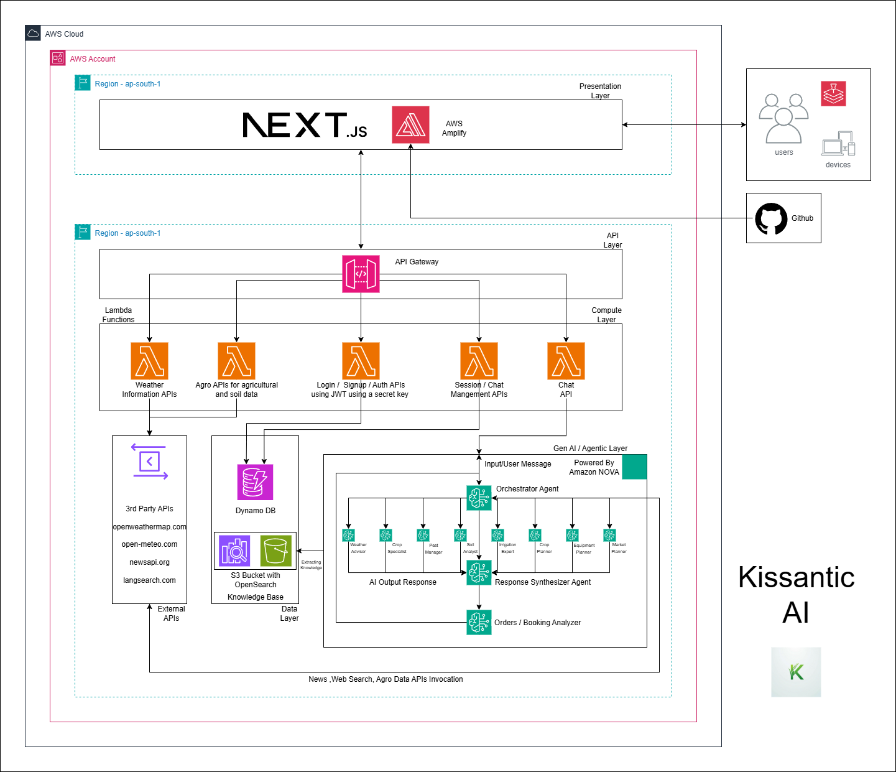

# Kisaantic AI (Farmers AI Friend)


**Empowering Farmers Through Multi-Agentic AI**


---

## Architecture & Deployment

### 🏗️ Complete AWS Infrastructure

Kisaantic AI is built on a fully serverless AWS architecture with manual service configuration for maximum control and optimization.

**📐 View Complete Architecture Documentation**: **[ARCHITECTURE.md](Docs/ARCHITECTURE.md)**

### Key Infrastructure Highlights

**Frontend Deployment**:
- ✅ **AWS Amplify** - Automatic CI/CD from GitHub
- ✅ **CloudFront CDN** - Global content delivery
- ✅ **Monorepo Support** - Automatic detection of Next.js 15 app
- ✅ **Auto-SSL** - Managed SSL/TLS certificates
- 🔗 **Live**: https://main.d1jex6uisa3pv2.amplifyapp.com

**Backend Infrastructure**:
- ✅ **19 AWS Lambda Functions** (Python 3.13) - Manually created via Console
- ✅ **API Gateway REST API** - Manually configured with Lambda Proxy integration
- ✅ **Extended Timeout** - Service quota increased to 90 seconds (1.5 minutes) for complex AI orchestration
- ✅ **CORS Enabled** - All endpoints configured for cross-origin requests
- ✅ **DynamoDB** - Single-table design with GSI indexes
- ✅ **AWS Bedrock** - 8 specialized agents + LLM orchestration

**Manual Configuration Approach**:
- All Lambda functions created individually via AWS Console
- API Gateway resources and methods configured manually
- Integration requests mapped directly to Lambda functions
- Lambda Proxy Integration enabled for structured event handling
- CORS configured per endpoint for cross-origin support
- Service quota request approved for extended API Gateway timeout

### Architecture Documentation Includes

The complete architecture document covers:

1. **High-Level System Architecture** - End-to-end data flow diagrams
2. **Frontend Architecture** - Amplify deployment, GitHub CI/CD, build configuration
3. **Backend Architecture** - 19 Lambda functions, layer structure, manual setup process
4. **API Architecture** - REST API Gateway configuration, CORS setup, Lambda proxy integration
5. **Database Architecture** - DynamoDB single-table design, access patterns
6. **AI/ML Architecture** - Bedrock agents, knowledge bases, orchestrator logic
7. **Deployment Process** - Step-by-step manual deployment workflows
8. **Service Configuration** - Detailed settings for each AWS service
9. **Security & Authentication** - Multi-layer security, IAM roles, JWT flow
10. **Monitoring & Logging** - CloudWatch configuration, metrics, alarms
11. **Scalability & Performance** - Auto-scaling, optimization strategies
12. **Cost Optimization** - Monthly cost breakdown, optimization tips

### Quick Architecture Facts

| Layer | Technology | Deployment | Scaling |
|-------|-----------|------------|---------|
| **Frontend** | Next.js 15 + React 19 | AWS Amplify (Auto) | Global CDN |
| **API** | REST API Gateway | Manual Console | 10K req/s |
| **Compute** | 19 Lambda Functions | Manual Console | Auto-scale |
| **Database** | DynamoDB | Manual Console | On-demand |
| **AI** | Bedrock (8 agents + 2 LLMs) | Bedrock Console | On-demand |
| **CDN** | CloudFront (via Amplify) | Automatic | Global |

### Service Quota Achievements

**API Gateway Timeout Extension**:
- Default timeout: 29 seconds ❌
- Requested: 90 seconds (1.5 minutes) ✅
- Status: **APPROVED** by AWS
- Impact: Enables complex multi-agent orchestration with parallel execution

**Why Extended Timeout Needed**:
- Query analysis: 1-2 seconds
- Agricultural data fetch: 2-3 seconds
- Parallel agent execution: 8-12 seconds
- Web search + news fetch: 3-5 seconds
- Response synthesis: 8-12 seconds
- **Total**: 24-30 seconds typical (up to 90 seconds for complex queries)

---

## User Guide

### 🌐 Try Kisaantic AI Now

Visit our live application: **[https://main.d1jex6uisa3pv2.amplifyapp.com](https://main.d1jex6uisa3pv2.amplifyapp.com)**

### 📚 Complete User Manual

For detailed instructions on using Kisaantic AI, including:
- **First-time setup and signup process**
- **Location permissions and why they matter**
- **Profile setup for personalized recommendations**
- **How to ask questions effectively**
- **50+ example questions for different farming needs**
- **Multilingual support** (Hindi, Telugu, Tamil, French, Spanish, Italian, and 50+ more languages)
- **Features overview and tips for best results**
- **Troubleshooting common issues**

**👉 Read the complete guide**: [USER-GUIDE.md](Docs/USER-GUIDE.md)

### Quick Start for New Users

1. **Visit**: [https://main.d1jex6uisa3pv2.amplifyapp.com](https://main.d1jex6uisa3pv2.amplifyapp.com)
2. **Sign Up**: Create account with email and password
3. **Allow Location**: Grant location permission for accurate recommendations
4. **Complete Profile**: Add farm size, primary crop, and location details
5. **Start Chatting**: Ask agricultural questions in any language!

**Example Question:**
```
"I have 50 acres in [your location]. What crop should I plant this 
season for maximum profit? Give me complete action plan with costs. 
Please respond in Hindi."
```

**Get comprehensive 3000-5000 word guidance** with:
- Real-time weather and soil data for your location
- ROI analysis and cost breakdowns
- Step-by-step action plan in table format
- Market intelligence and vendor recommendations
- Answers in your preferred language (50+ supported)

---

## 📖 Table of Contents

- [Our Story](#our-story)
- [What is Kisaantic AI?](#what-is-kisaantic-ai)
- [Key Features](#key-features)
- [Multi-Agentic Architecture](#multi-agentic-architecture)
- [Technology Stack](#technology-stack)
- [Architecture & Deployment](#architecture--deployment)
- [Getting Started](#getting-started)
- [User Guide](#user-guide)
- [Project Structure](#project-structure)
- [API Overview](#api-overview)
- [Screenshots](#screenshots)
- [Architecture Diagram](#architecture-diagram)
- [Roadmap](#roadmap)
- [Impact & Goals](#impact--goals)
- [Development Team](#development-team)
- [License](#license)

---

## Our Story

While my father served in the Indian administration, he witnessed dozens of farmers driven to suicide by a broken system that failed them. He eventually quit, but the trauma stayed with him and with us as teenagers. The only thing a farmer knows in India is farming. The agony of a farmer who ends up his life to feed the nation has carved an impact deep in our family.

**We are building a Multi-Agentic AI solution to remove dependence on politics and middlemen and give farmers the resources, markets, and resilience they deserve.**

---

## What is Kisaantic AI?

Kisaantic AI is an advanced AI-powered agricultural assistant leveraging **Amazon Bedrock's multi-agent orchestration** to create a sophisticated intelligent system. Built with 8 specialized domain agents coordinated by an LLM-powered orchestrator with 4 integrated API tools, and unified by a response synthesizer, our platform delivers contextual, comprehensive agricultural advice based on real-time weather, soil conditions, market data, and historical insights.

### The Problem We're Solving

- Farmers lose 30-40% of crop value to middlemen
- Lack of access to timely, personalized agricultural expertise
- Limited resources for weather forecasting, soil analysis, and market information
- Political dependencies that exploit vulnerable farming communities
- Information asymmetry that benefits intermediaries over farmers

### Our Solution

A direct, AI-powered farming advisor that:
- Provides instant access to expert agricultural knowledge through 8 specialized agents
- Uses LLM-based intelligent query routing across multiple domains
- Integrates real-time data through 4 API tools (Agricultural Data, Web Search, News Search, Market Data)
- Synthesizes comprehensive responses from multiple expert agents
- Delivers weather-aware, location-specific crop and market recommendations
- Offers pest management, irrigation, equipment, and market linkage guidance
- Maintains conversation history for ongoing support
- Operates 24/7 without dependency on external parties

---

## Key Features

### For Farmers

**Intelligent Multi-Agent System**
- 8 specialized domain expert agents
- LLM-powered orchestrator for intelligent query analysis and routing
- 4 API tools for real-time data integration
- Response synthesizer for coherent multi-agent synthesis
- Powered by AWS Bedrock (Nova Lite for agents & routing, Nova Pro for synthesis)
- Context-aware responses based on location and farm profile
- **Smart booking/order suggestions** - AI analyzes responses and suggests relevant services/products
- **One-click confirmations** - Approve equipment bookings and seed orders directly from chat

**Real-Time Data Integration via API Tools**
- Current weather conditions and 7-day forecasts (Agricultural Data Tool)
- Soil moisture analysis at 5 depth levels (Agricultural Data Tool)
- Historical climate baselines and anomaly detection (Agricultural Data Tool)
- Market intelligence and vendor information (Web Search Tool)
- Equipment availability and pricing (Web Search Tool)
- Latest agricultural news and policies (News Search Tool)
- Government schemes and subsidies (News Search Tool)
- **Vendor booking/order tracking** - Manage service bookings and product orders

**Personalized Experience**
- User profiles with farm details (size, crop type, location)
- Conversation history across sessions
- Location-based recommendations with GPS precision
- ROI analysis for crop planning
- **Multilingual support** - Ask and receive answers in 50+ languages including:
  - **Indian Languages**: Hindi, Telugu, Tamil, Bengali, Marathi, Gujarati, Kannada, Malayalam, Punjabi, Odia
  - **International**: French, Spanish, German, Italian, Portuguese, Russian, Japanese, Chinese, Arabic, and more
  - Natural language detection - just add "respond in [language]" to any question

### Technical Excellence

**Modern Tech Stack**
- Frontend: Next.js 15 + React 19 (legacy-peer-deps) + TypeScript
- Backend: AWS Lambda (Python 3.13) + API Gateway
- Database: DynamoDB (single-table design)
- AI: AWS Bedrock Agents (Nova Lite + Nova Pro)
- Authentication: JWT with refresh tokens

**Intelligent Orchestration System**
- LLM-based query analysis and agent routing
- Parallel execution of agent consultations and API calls
- Rich context including weather, soil, market, and farm data
- Multi-agent response synthesis for complex queries
- Historical chat context for continuity
- Real-time data integration from 4 external APIs

---

## Multi-Agentic Architecture

Kisaantic AI uses an **LLM-powered orchestration pattern** that intelligently coordinates multiple specialized agents and external data sources.

### Architecture Flow

```
┌─────────────────────────────────────────────────────────────┐
│                      User Query                             │
└───────────────────────────┬─────────────────────────────────┘
                            │
                            ▼
┌─────────────────────────────────────────────────────────────┐
│            Chat Lambda (Entry Point)                        │
│  • Authentication & session management                      │
│  • User context building                                    │
│  • Message persistence                                      │
└───────────────────────────┬─────────────────────────────────┘
                            │
                            ▼
┌─────────────────────────────────────────────────────────────┐
│         Multi-Agent Orchestrator (Core Intelligence)        │
│         Powered by: Amazon Nova Lite (routing LLM)          │
│                                                             │
│  Step 1: Invoke Agricultural Data API Tool                  │
│    → Fetch weather + soil + historical data                 │
│                                                             │
│  Step 2: LLM-Based Query Analysis                           │
│    → Analyzes query complexity                              │
│    → Determines required agents (0-6)                       │
│    → Decides if Web/News API tools needed                   │
│                                                             │
│  Step 3: Parallel Execution                                 │
│    → Invoke selected Bedrock agents                         │
│    → Invoke Web Search API Tool (if needed)                 │
│    → Invoke News Search API Tool (if needed)                │
│                                                             │
│  Step 4: Response Synthesis                                 │
│    → Powered by: Amazon Nova Pro                            │
│    → Combines all sources into unified response             │
└───────────────────────────┬─────────────────────────────────┘
                            │
        ┌───────────────────┼───────────────────┐
        │                   │                   │
        ▼                   ▼                   ▼
┌───────────────┐   ┌───────────────┐   ┌───────────────┐
│ 8 Domain      │   │ API Tools     │   │ Response      │
│ Expert Agents │   │ (4 tools)     │   │ Synthesizer   │
│ (Nova Lite)   │   │               │   │ (Nova Pro)    │
│               │   │ • Agro Data   │   │               │
│ • Weather     │   │ • Web Search  │   │ • Synthesis   │
│ • Crop        │   │ • News Search │   │ • Coherence   │
│ • Pest        │   │ • Market      │   │ • Formatting  │
│ • Soil        │   │               │   │               │
│ • Irrigation  │   │               │   │               │
│ • Planner     │   │               │   │               │
│ • Equipment   │   │               │   │               │
│ • Market      │   │               │   │               │
└───────────────┘   └───────────────┘   └───────────────┘
        │                   │                   │
        └───────────────────┼───────────────────┘
                            │
                            ▼
┌─────────────────────────────────────────────────────────────┐
│       Final Unified Response to Farmer                      │
│  • Comprehensive 3000-5000 word guidance                    │
│  • Real-time data integrated throughout                     │
│  • Actionable recommendations with costs/vendors            │
│  • Markdown formatted with tables and emojis                │
└─────────────────────────────────────────────────────────────┘
```

### How It Works

1. **User Query Processing**: 
   - Farmer sends query through chat interface
   - Chat Lambda authenticates, retrieves user profile & chat history

2. **Agricultural Data Tool Invocation**: 
   - Orchestrator invokes Agricultural Data API Tool first
   - Retrieves: current weather, soil moisture (5 depths), historical baselines
   - Data includes seasonal context, anomaly detection, GDD calculations

3. **LLM-Based Analysis Phase**: 
   - Nova Lite analyzes query with full context (user profile + agro data + chat history)
   - Determines query complexity and type
   - Selects 0-6 agents based on query requirements
   - Decides if Web Search or News Search API tools needed

4. **Parallel Execution**:
   - Selected Bedrock agents invoked simultaneously
   - Web Search API Tool invoked (up to 3 parallel queries)
   - News Search API Tool invoked (targeted query)
   - Each agent receives comprehensive context including real-time data

5. **Response Synthesis Phase**:
   - Nova Pro synthesizer receives all outputs
   - Combines orchestrator findings + agent responses + API results + agro data
   - Eliminates redundancy and ensures coherence
   - Formats as unified 3000-5000 word comprehensive response
   - Follows strict Kisaantic format with sections, tables, emojis

6. **Delivery**: 
   - Chat Lambda saves messages to DynamoDB
   - Comprehensive response delivered to farmer
   - Metadata tracked for analytics

### Key Architecture Benefits

- **Intelligent Routing**: LLM decides which experts and API tools to consult dynamically
- **Real-Time Integration**: Fresh agricultural data via API tools in every response
- **Parallel Processing**: Agents and API tool invocations execute simultaneously
- **Quality Synthesis**: Nova Pro ensures professional, coherent output
- **Contextual Awareness**: Full farm profile and environmental context shared
- **Modular Tool Integration**: Easy to add new API tools (Market Data tool coming in Phase 2)

---

## 8 Specialized AI Agents

### Domain Expert Agents

#### 1. Weather Advisor
- **Model**: Amazon Nova Lite
- **Focus**: Weather impact on farming, timing recommendations
- **Knowledge Base**: Weather patterns, seasonal guidance
- **Example**: "Should I plant wheat today given the forecast?"

#### 2. Crop Specialist
- **Model**: Amazon Nova Lite
- **Focus**: Crop selection, planting schedules, yield optimization
- **Knowledge Base**: Crop varieties, cultivation practices
- **Example**: "Which wheat variety is best for my soil type?"

#### 3. Pest Manager
- **Model**: Amazon Nova Lite
- **Focus**: Pest identification, IPM strategies, treatment timing
- **Knowledge Base**: Pest identification, disease management
- **Example**: "My wheat has yellow spots. What should I do?"

#### 4. Soil Analyst
- **Model**: Amazon Nova Lite
- **Focus**: Soil health, nutrient management, fertilizer recommendations
- **Knowledge Base**: Soil health, fertility management
- **Example**: "When should I apply fertilizer for maximum yield?"

#### 5. Irrigation Expert
- **Model**: Amazon Nova Lite
- **Focus**: Water management, irrigation scheduling
- **Knowledge Base**: Water management, irrigation techniques
- **Example**: "How much water does my crop need this week?"

#### 6. Crop Planner
- **Model**: Amazon Nova Lite
- **Focus**: Crop planning with ROI analysis and recommendations
- **Knowledge Base**: Crop planning, economic analysis
- **Example**: "Which crop will give me best returns this season?"

#### 7. Equipment Vendor
- **Model**: Amazon Nova Lite
- **Focus**: Equipment recommendations, vendors, rental services
- **Knowledge Base**: Madhya Pradesh equipment vendors
- **Example**: "Where can I rent a tractor in Madhya Pradesh?"

#### 8. Market Linkage
- **Model**: Amazon Nova Lite
- **Focus**: Market guidance, mandi prices, selling strategies
- **Knowledge Base**: Market data, pricing strategies
- **Example**: "What's the current market price for wheat?"

---

## External Data Sources (4 APIs)

### 1. Agro API (Internal)
- **Purpose**: Comprehensive agricultural context
- **Data Provided**:
  - Current weather (temperature, humidity, precipitation, wind, UV)
  - Soil moisture at 5 depths (0-1cm, 1-3cm, 3-9cm, 9-27cm, 27-81cm)
  - Soil temperature at multiple depths
  - Historical seasonal baselines (2-year averages)
  - Anomaly detection (warmer/cooler, wetter/drier)
  - Growing Degree Days (GDD)
  - Seasonal context (Rabi/Kharif/Zaid)
- **Integration**: HTTP call by orchestrator
- **Timing**: Fetched FIRST before query analysis

### 2. LangSearch (Web Search)
- **Purpose**: Current market intelligence, vendor info, recent developments
- **Usage**: When query involves prices, equipment availability, market trends
- **Integration**: HTTP POST with up to 3 parallel searches
- **Data**: Web pages, snippets, recent articles

### 3. NewsAPI.org
- **Purpose**: Latest agricultural news, policies, subsidies
- **Usage**: Government schemes, policy changes, market news
- **Integration**: HTTP GET with keyword queries
- **Data**: Recent articles with title, description, publish date

### 4. Open Meteo & OpenWeather
- **Purpose**: Detailed weather and soil data (accessed via Agro API)
- **Data**: Forecasts, historical patterns, soil conditions
- **Integration**: Accessed through internal Agro API wrapper

---

## Knowledge Bases (6)

### Domain Knowledge Bases (5)

1. **Weather Advisor KB**: Weather patterns, seasonal guidance
2. **Crop Specialist KB**: Crop varieties, best practices
3. **Soil Analyst KB**: Soil health, nutrient management
4. **Pest Manager KB**: Pest identification, IPM strategies
5. **Irrigation Expert KB**: Water management techniques

### Regional Knowledge Base (1)

6. **Madhya Pradesh Equipment Vendor KB**: Local vendors, equipment rental services, supplier contacts, pricing

All knowledge bases are stored in **Amazon S3** and integrated with agents via **Amazon Bedrock Knowledge Bases** (Vector Store using RAG).

---

## Technology Stack

### Frontend
- **Framework**: Next.js 15.2.4 with App Router
- **UI Library**: React 19 (installed with --legacy-peer-deps)
- **Language**: TypeScript 5
- **Styling**: Tailwind CSS 4.1.9
- **Components**: shadcn/ui (Radix UI)
- **Forms**: React Hook Form + Zod
- **Maps**: React Leaflet + Pigeon Maps
- **Markdown**: React Markdown with remark-gfm

### Backend
- **Compute**: AWS Lambda (Python 3.13)
- **API**: AWS API Gateway (REST)
- **Database**: DynamoDB (NoSQL, single-table design)
- **AI Models**:
  - Amazon Nova Lite: Query routing LLM + 8 domain agents
  - Amazon Nova Pro: Response synthesizer
- **Auth**: JWT (PyJWT)
- **HTTP**: aiohttp for async API calls
- **Libraries**: boto3, pydantic, asyncio

### External APIs
- **Weather/Soil**: Open Meteo, OpenWeather API
- **News**: NewsAPI.org
- **Web Search**: LangSearch
- **Integration**: Direct HTTP calls from orchestrator

### AWS Services
- Lambda (19 functions)
- API Gateway (REST API)
- DynamoDB (single-table design)
- Bedrock (10 AI components: 8 agents + routing LLM + synthesizer)
- S3 (Knowledge Bases)
- CloudWatch (Monitoring & Logs)

### API Tools Architecture
- 4 integrated API tools (3 active + 1 planned)
- Agricultural Data Tool (internal Lambda aggregator)
- Web Search Tool (LangSearch integration)
- News Search Tool (NewsAPI.org integration)
- Market Data Tool (Phase 2)

---

## Getting Started

### For Users

**🌐 Live Application**: [https://main.d1jex6uisa3pv2.amplifyapp.com](https://main.d1jex6uisa3pv2.amplifyapp.com)

**📚 New to Kisaantic AI?** Check out our comprehensive [User Guide](Docs/USER-GUIDE.md) for:
- Step-by-step setup instructions
- How to ask questions effectively
- 50+ example questions for different farming scenarios
- Multilingual support guide (Hindi, Telugu, Tamil, French, Spanish, and 50+ languages)
- Tips for getting the best recommendations

**Quick Start:**
1. Visit the application link above
2. Sign up with your email
3. Allow location permission for accurate data
4. Complete your farmer profile (farm size, crop type, location)
5. Start asking agricultural questions in any language!

### For Developers

**📐 Infrastructure Setup?** Check [ARCHITECTURE.md](Docs/ARCHITECTURE.md) for complete AWS deployment guide including:
- Manual Lambda creation via Console (19 functions)
- API Gateway REST API configuration
- Lambda Proxy Integration setup
- Service quota requests
- Amplify deployment from GitHub

#### Prerequisites
- Node.js 18+
- Python 3.13
- AWS Account with Bedrock access
- API Keys: LangSearch, NewsAPI
- Git

#### Frontend Setup

```bash
cd App
npm install --legacy-peer-deps
npm run dev
```

Visit [http://localhost:3000](http://localhost:3000)

#### Backend Setup

```bash
cd Backend
python -m venv venv
source venv/bin/activate  # On Windows: venv\Scripts\activate
pip install -r requirements.txt
```

**For AWS Deployment**: Follow the complete step-by-step guide in [ARCHITECTURE.md](Docs/ARCHITECTURE.md)

#### Environment Variables

**Backend Lambda Environment Variables:**
```env
USE_ORCHESTRATOR=true
OUTPUT_TOKEN_LIMIT=5000
CHAT_HISTORY_LIMIT=10
AGRO_API_URL=https://your-api-gateway/api
LANGSEARCH_API_KEY=your_key
NEWS_API_KEY=your_key
```

**Frontend `.env.local`:**
```env
NEXT_PUBLIC_API_URL=your-api-gateway-url
```

---

## Project Structure

```
Kisaantic-AI/
├── App/                      # Frontend (Next.js)
│   ├── app/                 # Pages (App Router)
│   │   ├── chat/           # Multi-agent chat interface
│   │   ├── login/          # Authentication
│   │   └── profile/        # User profile
│   ├── components/          # React components
│   │   ├── auth/           # Auth forms
│   │   ├── chat/           # Chat UI
│   │   └── ui/             # shadcn/ui components
│   ├── contexts/            # React contexts
│   │   └── auth-context.tsx # JWT management
│   └── lib/                 # Utilities
│       ├── api.ts          # API client
│       └── auth.ts         # Auth helpers
│
├── Backend/                  # Backend (AWS Lambda)
│   ├── lambdas/             # 19 Lambda functions
│   │   ├── auth/           # Authentication (6 functions)
│   │   │   ├── signup.py
│   │   │   ├── login.py
│   │   │   ├── refresh.py
│   │   │   ├── logout.py
│   │   │   ├── get-me.py
│   │   │   └── update-me.py
│   │   │
│   │   ├── chat/           # Chat orchestration (1 function)
│   │   │   └── lambda_handler.py    # Main chat entry point
│   │   │
│   │   ├── weather/        # Weather APIs (3 functions)
│   │   │   ├── current.py
│   │   │   ├── forecast.py
│   │   │   └── history.py
│   │   │
│   │   ├── agro/           # Agricultural data (4 functions)
│   │   │   ├── soil.py
│   │   │   ├── news.py
│   │   │   ├── market.py
│   │   │   └── complete.py  # Combined endpoint
│   │   │
│   │   └── session/        # Session management (5 functions)
│   │       ├── create.py
│   │       ├── list.py
│   │       ├── get.py
│   │       ├── update.py
│   │       └── delete.py
│   │
│   ├── lambda-layers/       # Shared code
│   │   ├── utils/python/
│   │   │   ├── dynamodb_helper.py    # DynamoDB operations
│   │   │   ├── auth.py               # JWT utilities
│   │   │   └── schemas.py            # Pydantic models
│   │   │
│   │   └── bedrock-integration/python/
│   │       ├── orchestrator.py       # Multi-agent orchestration
│   │       └── agriculture_context.py # Context builder
│   │
│   └── Bedrock/             # Bedrock configurations
│       ├── agents/          # 8 agent configurations
│       │   ├── weather_advisor/
│       │   ├── crop_specialist/
│       │   ├── pest_manager/
│       │   ├── soil_analyst/
│       │   ├── irrigation_expert/
│       │   ├── crop_planner/
│       │   ├── equipment_vendor/
│       │   └── market_linkage/
│       │
│       ├── knowledge-bases/ # 6 knowledge base configs
│       │   ├── weather_kb/
│       │   ├── crop_kb/
│       │   ├── pest_kb/
│       │   ├── soil_kb/
│       │   ├── irrigation_kb/
│       │   └── mp_vendor_kb/
│       │
│       └── agent_config.json # Agent IDs and aliases
│
├── README.md                 # API Documentation
├── PROJECT-README.md        # This file
├── Code-Readme.md           # Technical Documentation
├── USER-GUIDE.md            # User Manual for Farmers
├── ARCHITECTURE.md          # Infrastructure & Deployment Guide
└── LICENSE                  # MIT License
```

---

## API Overview

### Authentication (6 Lambdas)
- `POST /api/auth/signup` - Create new account
- `POST /api/auth/login` - Login
- `POST /api/auth/refresh` - Refresh access token
- `POST /api/auth/logout` - Logout
- `GET /api/auth/me` - Get current user profile
- `PUT /api/auth/me` - Update profile

### Chat (1 Lambda - Multi-Agent Orchestration)
- `POST /api/chat` - Send message to intelligent multi-agent system

### Weather (3 Lambdas)
- `GET /api/weather/current` - Current weather
- `GET /api/weather/forecast` - 7-day forecast
- `GET /api/weather/history` - Historical data

### Agricultural Data (4 Lambdas)
- `GET /api/agro/soil` - Soil moisture data
- `GET /api/agro/news` - Agricultural news
- `GET /api/agro/market` - Market prices
- `GET /api/agro/complete` - Complete agricultural dataset

### Sessions (5 Lambdas)
- `POST /api/sessions` - Create chat session
- `GET /api/sessions` - List all sessions
- `GET /api/sessions/{id}` - Get session with messages
- `PUT /api/sessions/{id}` - Update session title
- `DELETE /api/sessions/{id}` - Delete session

### Bookings & Orders (2 Lambdas)
- `GET /api/bookings-orders` - Get all bookings/orders with filters
- `PUT /api/bookings-orders/update` - Update booking/order status

**Complete API documentation**: [API-README.md](Docs/API-README.md)

---

## Screenshots

### Application Screenshots

#### 1. Landing Page
- Features Our Vision for the Application


#### 2. Authentication & Onboarding
- Login/Signup Interface
- Profile Setup with Location Selection


#### 3. Chat Interface
- Multi-Agent Chat with Comprehensive Responses
- Real-Time Data Integration Display
- Markdown Formatted Responses with Tables


#### 4. User Management
- Profile Dashboard
- Farm Details Management
- Session History Browser


#### 5. Mobile Experience
- Responsive Mobile Interface
- PWA Features
- Touch-Optimized Chat


---

## Architecture Diagram



*Comprehensive system architecture showing:*
- *Frontend (Next.js) → API Gateway → Chat Lambda*
- *Chat Lambda → Orchestrator with LLM-based routing*
- *Orchestrator → Parallel execution (8 Agents + 4 APIs)*
- *Nova Pro Synthesizer → Unified Response*
- *DynamoDB for persistence, S3 for knowledge bases*

---

## Roadmap

### ✅ Phase 1 (Completed - Oct 2025)
- LLM-powered multi-agent orchestration system
- 8 specialized domain expert agents
- Real-time agricultural data integration (weather + soil + historical)
- 4 API tool integrations (Agricultural Data, Web Search, News Search, planned Market Data)
- Intelligent query analysis and agent routing
- Parallel execution engine
- Advanced response synthesis (3000-5000 word comprehensive guidance)
- User authentication and profiles
- Chat session management with full history
- 6 knowledge bases with vector search
- 19 Lambda functions with API Gateway
- DynamoDB single-table design
- Next.js 15 + React 19 frontend (legacy-peer-deps)
- Madhya Pradesh equipment vendor integration
- **Multilingual support** (50+ languages via Amazon Nova Pro including Hindi, Telugu, Tamil, Bengali, Marathi, French, Spanish, Italian, German, and more)
- Location-based recommendations with GPS integration
- Progressive Web App (PWA) for mobile installation

### 🔄 Phase 2 (Q1 2026)
- Enhanced market price API with real-time mandi data
- Direct buyer-farmer marketplace beta
- Government scheme recommendations API integration
- Crop insurance guidance module
- Performance optimization and response caching
- Voice input integration with dialect support (for supported Indian languages)
- Native mobile applications (iOS & Android)
- Enhanced multilingual UI (interface in Hindi, Telugu, Tamil)

### 📋 Phase 3 (Q2-Q3 2026)
- Expanded multilingual UI support (interface in 10+ languages)
- Advanced voice-to-text with regional dialect recognition
- SMS fallback for low-connectivity areas (USSD integration)
- Community forum for peer-to-peer farmer support
- Video tutorials and visual guides library
- Regional expansion: Punjab, Haryana, Uttar Pradesh, Maharashtra, Karnataka
- Vendor knowledge bases for expanded regions
- Offline mode with cached responses

### 📋 Phase 4 (2027 - Long-term Vision)
- AI-powered yield prediction models (ML integration)
- Satellite imagery integration for crop monitoring
- IoT sensor integration for real-time farm monitoring
- Automated farm equipment recommendations with vendor booking
- Financial services integration (micro-loans, insurance claims)
- Supply chain optimization platform
- Blockchain-based transparent pricing system
- Regional cooperative networks and FPO integration
- Export market guidance for farmers

---

## Impact & Goals

### Current Status (Oct 2025)
- 🌾 Intelligent multi-agent system operational with LLM routing
- 🤖 Processing agricultural queries with dynamic 0-8 agent consultation
- 🌍 Serving farmers with comprehensive, real-time data-driven advice
- 📊 Integrated 4 API tools for fresh agricultural intelligence
- 🎯 Achieving 3000-5000 word comprehensive responses per query
- ⚡ Sub-30 second response times with parallel execution
- 🗣️ **Multilingual support active** - Serving farmers in 50+ languages including all major Indian languages
- 🌐 **Live application deployed** and accessible worldwide

### Goals for 2026
- 📈 Reach 10,000 active farmers across 5 states
- 💰 Help farmers save ₹1000+ per acre through optimized decisions
- 🌱 Improve crop yields by 15-20% through data-driven advice
- 🤝 Eliminate middleman dependencies for participating farmers
- 🏆 Expand to 5+ states beyond Madhya Pradesh
- 📱 Launch native mobile apps with 50K+ downloads
- 🗣️ **Expand multilingual UI support** - Interface available in 10+ languages beyond response synthesis
- 🎤 Voice input with dialect support for major Indian languages
- 👥 Build farmer community of 100K+ registered users

### Long-term Vision (by 2027)
Empower **100,000+ farmers** across India with AI-driven agricultural intelligence, creating a sustainable ecosystem where farmers:
- Retain full value of their work (eliminate 30-40% middleman losses)
- Make data-driven decisions independently
- Access markets, equipment, and expertise directly
- Increase yields by 20-25% through optimized practices
- Build resilience against climate anomalies
- Connect with cooperatives and buyer networks

**Ultimate Goal**: Transform agricultural decision-making from dependency-based to AI-powered independence.

---

## Documentation

### For Users
- **[User Guide](Docs/USER-GUIDE.md)** - Complete guide for farmers using Kisaantic AI
  - First-time setup and navigation
  - How to ask effective questions
  - 50+ example questions for different scenarios
  - Multilingual support guide (50+ languages)
  - Tips and troubleshooting

### For Developers & DevOps
- **[Architecture Documentation](Docs/ARCHITECTURE.md)** - Complete infrastructure guide
  - AWS service configuration details
  - Manual deployment processes
  - Lambda function setup (19 functions)
  - API Gateway configuration (REST API with Lambda Proxy)
  - Service quota management
  - Amplify CI/CD from GitHub
  - Security and IAM configuration
  - Monitoring and cost optimization

- **[API Documentation](Docs/API-README.md)** - Complete REST API reference
  - Authentication endpoints
  - Chat orchestration API
  - Weather and agricultural data APIs
  - Session management
  - Request/response schemas

- **[Technical Documentation](Docs/CODE-README.md)** - Implementation details
  - Multi-agent orchestration architecture
  - LLM-powered routing system
  - API tools integration
  - Database design
  - Code examples and logic

---

## License

This project is licensed under the MIT License - see the [LICENSE](LICENSE) file for details.

---

## Acknowledgments

- **AWS Bedrock Team**: For Nova Lite and Nova Pro models enabling intelligent orchestration and multilingual synthesis across 50+ languages
- **Agricultural Experts**: For domain knowledge validation and feedback
- **Open Source Community**: For amazing libraries (aiohttp, boto3, Next.js ecosystem)
- **Farmers**: The inspiration, purpose, and beneficiaries of this project - your feedback shapes every feature

---

**Built with ❤️ for farmers, by engineers who care.**

*"Every farmer deserves the power of AI, not the burden of middlemen."*

---

**Last Updated**: October 19, 2025  
**Version**: 2.0.0 (Intelligent Multi-Agentic Architecture)